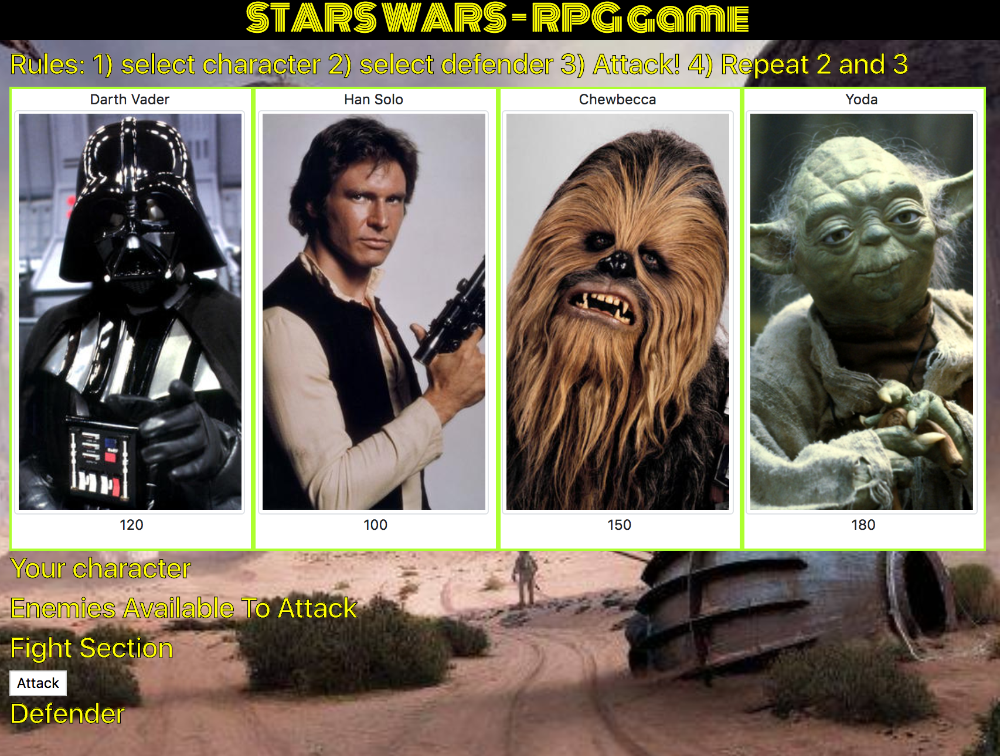

# unit-4-game

STARS WARS - RPG game



# STARS WARS - RPG game

> Rules

An role playing game in which the user selects a character and then must defeat all remaining enemies through battle. Note: The selected charater's attack power (attack points) increases with the number of attacks whereas the defender's attacks power (counter attack points) remain the same.

## Installing / Getting started

Simply head [here](http://amritsingh.ca/unit-4-game/) to to start playing!

## Developing

Feel free to modify/expand upon my code for your purposes!

```shell
git clone https://github.com/singha53/Word-Guess-Game.git
cd Word-Guess-Game/
```

## Scripting/Programming Languages

- HTML, CSS, JavaScript (and JQuery)

## Features

- non-stop playing!

## Contributing

If you'd like to contribute, please fork the repository and use a feature
branch. Pull requests are warmly welcome.

## Links

Even though this information can be found inside the project on machine-readable
format like in a .json file, it's good to include a summary of most useful
links to humans using your project. You can include links like:

- Game homepage: http://amritsingh.ca/Word-Guess-Game/
- Repository: https://github.com/singha53/Word-Guess-Game

## Licensing

The code in this project is licensed under MIT license.
